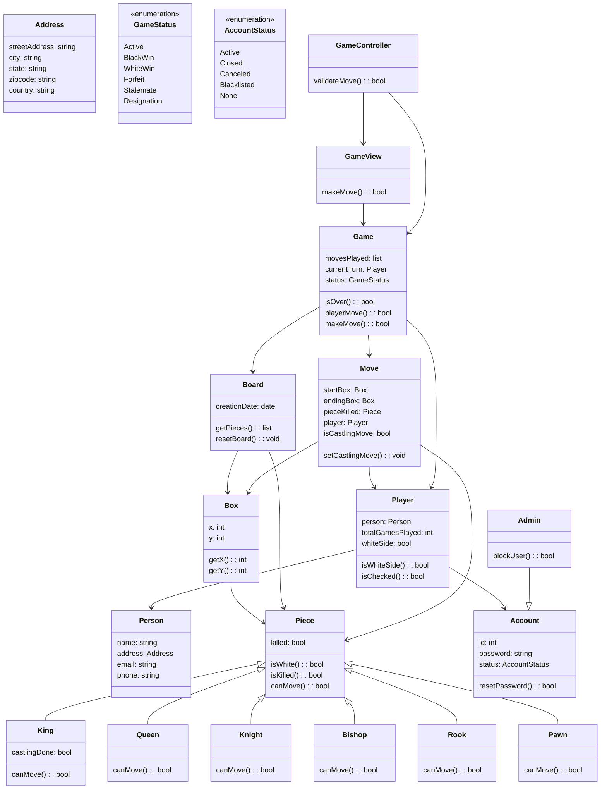

```mermaid
classDiagram
    class Address {
        streetAddress: string
        city: string
        state: string
        zipcode: string
        country: string
    }

    class Person {
        name: string
        address: Address
        email: string
        phone: string
    }

    class GameStatus {
        <<enumeration>>
        Active
        BlackWin
        WhiteWin
        Forfeit
        Stalemate
        Resignation
    }

    class AccountStatus {
        <<enumeration>>
        Active
        Closed
        Canceled
        Blacklisted
        None
    }

    class Move {
        startBox: Box
        endingBox: Box
        pieceKilled: Piece
        player: Player
        isCastlingMove: bool
        setCastlingMove(): void
    }

    class Box {
        x: int
        y: int
        getX(): int
        getY(): int
    }

    class Board {
        creationDate: date
        getPieces(): list<Piece>
        resetBoard(): void
    }

    class Piece {
        killed: bool
        isWhite(): bool
        isKilled(): bool
        canMove(): bool
    }

    class King {
        castlingDone: bool
        canMove(): bool
    }

    class Queen {
        canMove(): bool
    }

    class Knight {
        canMove(): bool
    }

    class Bishop {
        canMove(): bool
    }

    class Rook {
        canMove(): bool
    }

    class Pawn {
        canMove(): bool
    }

    class Game {
        movesPlayed: list<Move>
        currentTurn: Player
        status: GameStatus
        isOver(): bool
        playerMove(): bool
        makeMove(): bool
    }

    class Player {
        person: Person
        totalGamesPlayed: int
        whiteSide: bool
        isWhiteSide(): bool
        isChecked(): bool
    }

    class Account {
        id: int
        password: string
        status: AccountStatus
        resetPassword(): bool
    }

    class GameController {
        validateMove(): bool
    }

    class GameView {
        makeMove(): bool
    }

    class Admin {
        blockUser(): bool
    }

    GameController --> Game
    GameController --> GameView
    GameView --> Game
    Admin --|> Account

    Game --> Board
    Game --> Player
    Game --> Move
    Player --> Person
    Player --> Account

    Move --> Box
    Move --> Piece
    Move --> Player

    Board --> Box
    Board --> Piece
    Box --> Piece

    Piece <|-- King
    Piece <|-- Queen
    Piece <|-- Knight
    Piece <|-- Bishop
    Piece <|-- Rook
    Piece <|-- Pawn

```