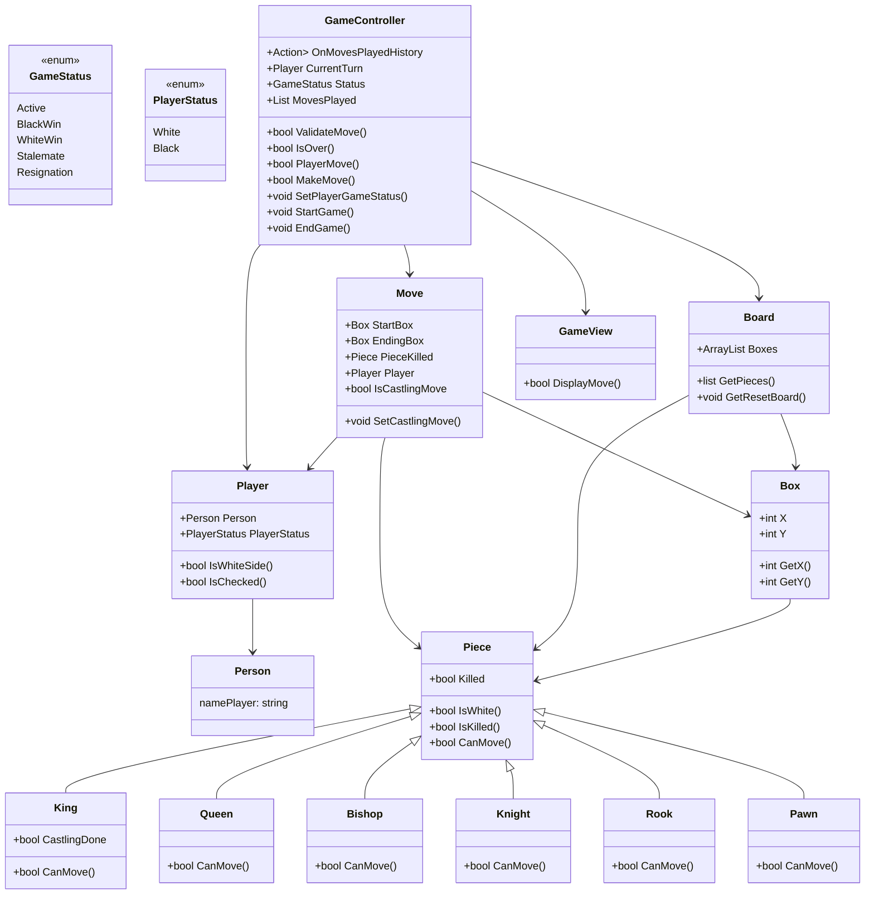

```mermaid

    classDiagram

        class Person {
            namePlayer: string
        }

        class GameStatus {
            <<enum>>
            Active
            BlackWin
            WhiteWin
            Stalemate
            Resignation
        }

        class PlayerStatus {
            <<enum>>
            White
            Black
        }

        class Move {
            +Box StartBox
            +Box EndingBox
            +Piece PieceKilled
            +Player Player
            +bool IsCastlingMove

            +void SetCastlingMove()
        }

        class Box {
            +int X 
            +int Y

            +int GetX()
            +int GetY()
        }

        class Board {
            +ArrayList<Box> Boxes

            +list<Piece> GetPieces()
            +void GetResetBoard()
        }

        class Piece {
            +bool Killed

            +bool IsWhite()
            +bool IsKilled()
            +bool CanMove()
        }

        class King {
            +bool CastlingDone

            +bool CanMove()
        }

        class Queen {
            +bool CanMove()
        }

        class Bishop {
            +bool CanMove()
        }

        class Knight {
            +bool CanMove()
        }
        
        class Rook {
            +bool CanMove()
        }

        class Pawn {
            +bool CanMove()
        }

        class Player {
            +Person Person
            +PlayerStatus PlayerStatus
            <!-- +bool WhiteSide -->

            +bool IsWhiteSide()
            +bool IsChecked()
        }

        class GameController {
            +Action<List<Move>> OnMovesPlayedHistory
            +Player CurrentTurn
            +GameStatus Status
            +List<Move> MovesPlayed

            +bool ValidateMove()
            +bool IsOver()
            +bool PlayerMove()
            +bool MakeMove()
            +void SetPlayerGameStatus()
            +void StartGame()
            +void EndGame()
        }

        class GameView {

            +bool DisplayMove()
        }

        GameController --> Player
        GameController --> GameView
        GameController --> Board
        GameController --> Move

        Player --> Person

        Move --> Box
        Move --> Piece
        Move --> Player

        Board --> Box
        Board --> Piece
        Box --> Piece

        Piece <|-- King
        Piece <|-- Queen
        Piece <|-- Bishop
        Piece <|-- Knight
        Piece <|-- Rook
        Piece <|-- Pawn

```