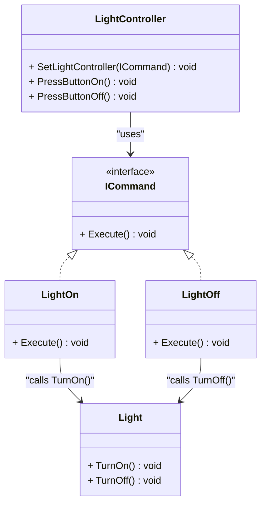

```mermaid
classDiagram
    class ICommand {
        <<interface>>
        + Execute() void
    }

    class Light {
        + TurnOn() void
        + TurnOff() void
    }

    class LightOn {
        + Execute() void
    }

    class LightOff {
        + Execute() void
    }

    class LightController {
        + SetLightController(ICommand) void
        + PressButtonOn() void
        + PressButtonOff() void
    }

    ICommand <|.. LightOn
    ICommand <|.. LightOff
    LightOn --> Light : "calls TurnOn()"
    LightOff --> Light : "calls TurnOff()"
    LightController --> ICommand : "uses"
```
