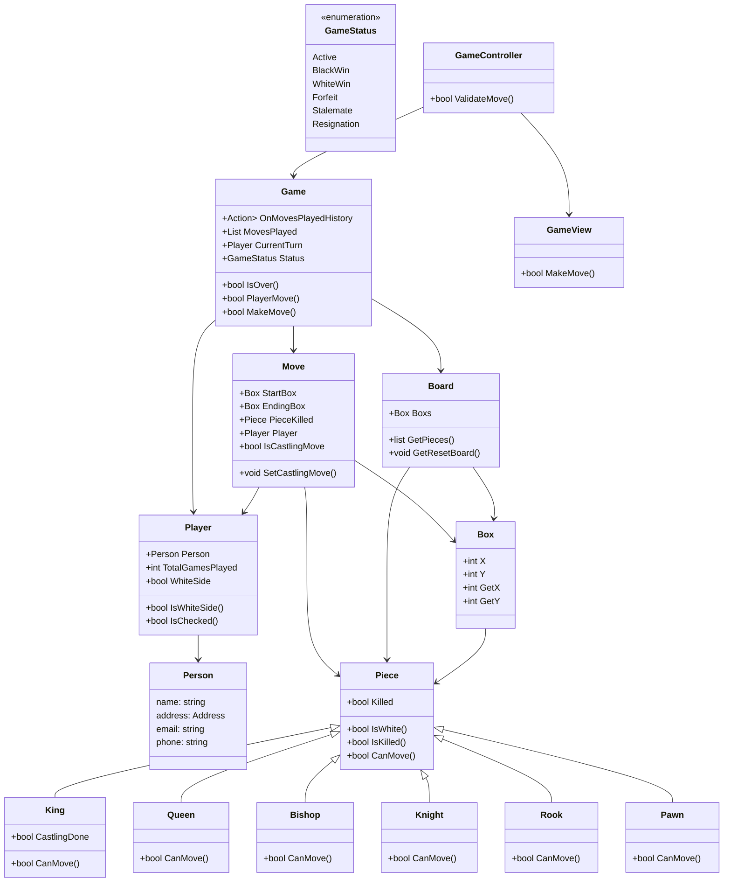

```mermaid
classDiagram

    class Person {
        name: string
        address: Address
        email: string
        phone: string
    }

    class GameStatus {
        <<enumeration>>
        Active
        BlackWin
        WhiteWin
        Forfeit
        Stalemate
        Resignation
    }

    class Move {
        +Box StartBox
        +Box EndingBox
        +Piece PieceKilled
        +Player Player
        +bool IsCastlingMove

        +void SetCastlingMove()
    }

    class Box {
        +int X 
        +int Y

        +int GetX
        +int GetY
    }

    class Board {
        +Box Boxs

        +list<Piece> GetPieces()
        +void GetResetBoard()
    }

    class Piece {
        +bool Killed

        +bool IsWhite()
        +bool IsKilled()
        +bool CanMove()
    }

    class King {
        +bool CastlingDone

        +bool CanMove()
    }

    class Queen {
        +bool CanMove()
    }

    class Bishop {
        +bool CanMove()
    }

    class Knight {
        +bool CanMove()
    }
    
    class Rook {
        +bool CanMove()
    }

    class Pawn {
        +bool CanMove()
    }


    class Game {
        +Action<List<Move>> OnMovesPlayedHistory
        +List<Move> MovesPlayed
        +Player CurrentTurn
        +GameStatus Status

        +bool IsOver()
        +bool PlayerMove()
        +bool MakeMove()
    }

    class Player {
        +Person Person
        +int TotalGamesPlayed
        +bool WhiteSide

        +bool IsWhiteSide()
        +bool IsChecked()
    }

    class GameController {
        +bool ValidateMove()
    }

    class GameView {
        +bool MakeMove()
    }

    GameController --> Game
    GameController --> GameView

    Player --> Person

    Game --> Board
    Game --> Move
    Game --> Player

    Move --> Box
    Move --> Piece
    Move --> Player

    Board --> Box
    Board --> Piece
    Box --> Piece

    Piece <|-- King
    Piece <|-- Queen
    Piece <|-- Bishop
    Piece <|-- Knight
    Piece <|-- Rook
    Piece <|-- Pawn
    
```