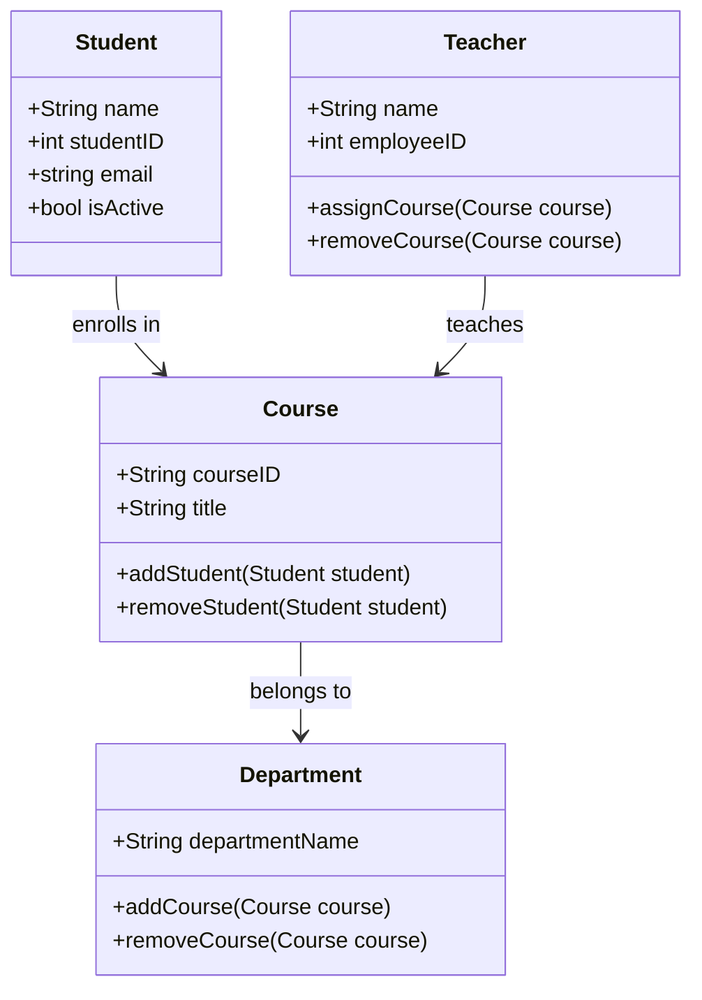

```mermaid
classDiagram
    direction TB

    class Student {
        +String name
        +int studentID
        +string email
        +bool isActive
    }
    
    class Course {
        +String courseID
        +String title
        +addStudent(Student student)
        +removeStudent(Student student)
    }
    
    class Department {
        +String departmentName
        +addCourse(Course course)
        +removeCourse(Course course)
    }
    
    class Teacher {
        +String name
        +int employeeID
        +assignCourse(Course course)
        +removeCourse(Course course)
    }
    
    Student --> Course : enrolls in
    Course --> Department : belongs to
    Teacher --> Course : teaches

```